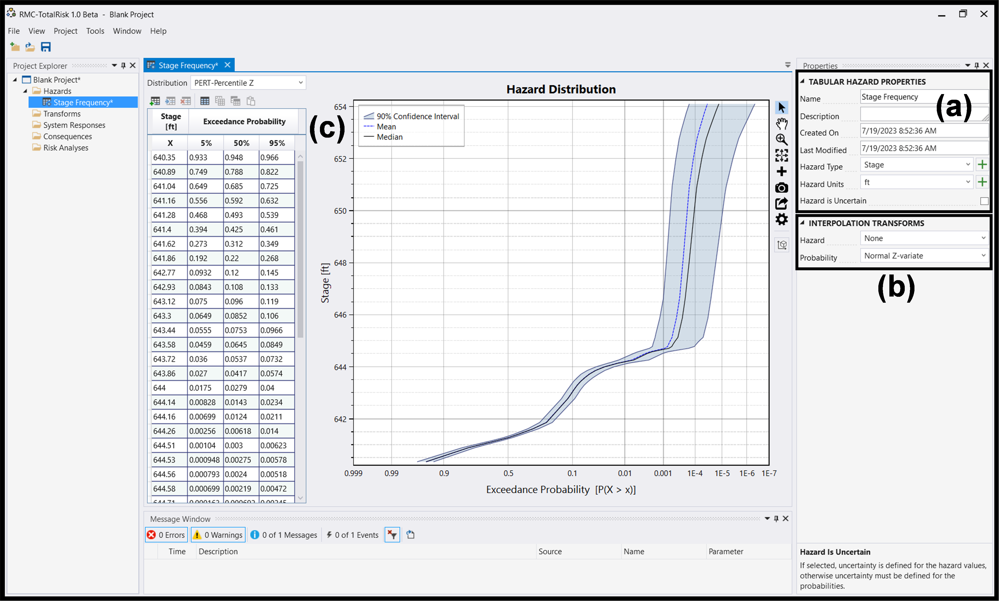

# Hydrologic Hazard - Single Potential Failure Mode

## Background

A risk analysis is being conducted on an earthen embankment dam with a concrete gated spillway. There are no operational performance components of concern for the risk analysis, and the dam is being evaluated for a single hydrologic risk-driving potential failure mode (PFM) of backward erosion piping (BEP) of foundation sands. Key elevations for the dam are shown in Table \@ref(tab:table-1).

```{r table-1, tidy=FALSE, echo=FALSE}
library(knitr)
library(kableExtra)

# Create the table
table_data <- data.frame(
  Elevation = c("Normal High Pool", "Top of Active Storage", "Top of Dam", "Probable Maximum Flood"),
  Value = c(641.00, 644.00, 549.65, 654.10)
)

kable(table_data, 
      col.names = c("Elevation (NAVD88)", "Value"), 
      booktabs = TRUE, 
      caption = "Key Elevations")
```

## Model Development

### Hazard Function

The dam is subjected to a hydrologic hazard that is represented by a stage frequency curve. The stage frequency curve has been provided in tabular format, represented by the 5th percentile, 50th percentile, and 95th percentile annual exceedance probabilities (AEP) for each stage. To begin building the model, add a tabular hazard function as demonstrated in the following steps and in Figure \@ref(fig:figure-1).

1. Right-click on the  **Hazards** folder in the Project Explorer window and select  **Add Tabular Hazard...** Name the hazard function in the prompt (e.g., Stage Frequency) and press **OK**.

2. The hazard for the stage frequency curve is stage and is measured in feet. In the **Tabular Hazard Properties** section of the Properties window, Figure \@ref(fig:figure-1)(a), select *Stage* for **Hazard Type** and *ft* for **Hazard Units**. The stage frequency data contains fixed stages and uncertainty for the AEP values. Since uncertainty is defined for the probabilities in the stage frequency relationship and not the hazard, uncheck the **Hazard is Uncertain** check box.

3. The stage frequency curve is generally plotted on a normal probability-linear scale (i.e., AEP plotted on the x-axis on a normal probability scale and stage plotted on the y-axis on a linear scale). In the Interpolation Transforms section of the Properties window, the **Hazard** is set to *None* (linear interpolation), and the **Probability** is set to *Normal Z-variate*, Figure \@ref(fig:figure-1)(b).

4. Select an appropriate input distribution that best defines the stage frequency dataset and enter the data into the hazard function. Uncertainty in the AEP values for this example is defined by 5th, 50th, and 95th percentile values. For this dataset, *PERT-Percentile Z* is selected from the *Distribution** drop-down menu. Enter the hazard function from Table 2 by copying and pasting into the table as indicated in Figure \@ref(fig:figure-1)(c).

```{r table-2, tidy=FALSE, echo=FALSE}
library(knitr)
library(kableExtra)

# Create the table
table_data <- data.frame(
  "Stage" = c(640.35, 640.89, 641.04, 641.16, 641.28, 641.4, 641.62, 641.86, 642.77, 642.93, 643.12, 643.3, 643.44, 643.58, 643.72, 643.86, 644, 644.14, 644.16, 644.26, 644.51, 644.53, 644.56, 644.58, 644.71, 644.78, 644.87, 644.95, 645.04, 645.13, 645.29, 645.87, 646.64, 648.14, 650.65, 650.93, 652.01, 652.37, 652.77, 653.14, 653.78, 653.87, 653.96, 654.05, 654.1),
  "5th" = c(9.33E-01, 7.49E-01, 6.49E-01, 5.56E-01, 4.68E-01, 3.94E-01, 2.73E-01, 1.92E-01, 9.32E-02, 8.43E-02, 7.50E-02, 6.49E-02, 5.55E-02, 4.59E-02, 3.60E-02, 2.70E-02, 1.75E-02, 8.28E-03, 6.99E-03, 2.56E-03, 1.04E-03, 9.48E-04, 7.93E-04, 6.99E-04, 1.63E-04, 1.00E-04, 8.68E-05, 7.52E-05, 6.21E-05, 5.00E-05, 4.58E-05, 3.32E-05, 2.52E-05, 1.60E-05, 7.33E-06, 6.54E-06, 3.48E-06, 2.71E-06, 2.01E-06, 1.33E-06, 6.00E-07, 5.39E-07, 4.81E-07, 4.24E-07, 3.95E-07),
  "50th" = c(9.48E-01, 7.88E-01, 6.85E-01, 5.92E-01, 4.93E-01, 4.25E-01, 3.12E-01, 2.20E-01, 1.20E-01, 1.08E-01, 9.60E-02, 8.52E-02, 7.53E-02, 6.45E-02, 5.37E-02, 4.17E-02, 2.79E-02, 1.43E-02, 1.24E-02, 6.18E-03, 3.00E-03, 2.75E-03, 2.40E-03, 2.19E-03, 6.92E-04, 6.41E-04, 5.77E-04, 5.20E-04, 4.58E-04, 4.00E-04, 3.75E-04, 2.99E-04, 2.52E-04, 1.83E-04, 1.13E-04, 1.07E-04, 7.37E-05, 6.31E-05, 5.16E-05, 4.03E-05, 2.49E-05, 2.31E-05, 2.14E-05, 1.98E-05, 1.90E-05),
  "95th" = c(9.66E-01, 8.22E-01, 7.25E-01, 6.32E-01, 5.39E-01, 4.61E-01, 3.49E-01, 2.68E-01, 1.45E-01, 1.33E-01, 1.19E-01, 1.06E-01, 9.66E-02, 8.49E-02, 7.32E-02, 5.74E-02, 4.00E-02, 2.34E-02, 2.11E-02, 1.40E-02, 6.23E-03, 5.78E-03, 5.18E-03, 4.72E-03, 2.45E-03, 1.98E-03, 1.91E-03, 1.84E-03, 1.76E-03, 1.68E-03, 1.59E-03, 1.23E-03, 9.50E-04, 7.68E-04, 5.39E-04, 5.17E-04, 3.92E-04, 3.49E-04, 3.07E-04, 2.56E-04, 1.78E-04, 1.67E-04, 1.58E-04, 1.48E-04, 1.43E-04)
)

# Manually renaming the columns
colnames(table_data) <- c("Stage", "5th", "50th", "95th")

# If the number of columns is correct, display the table using kable
if (ncol(table_data) == 4) {
  table_data$`Stage` <- format(table_data$`Stage`, scientific = FALSE)
  table_data$`5th` <- format(table_data$`5th`, scientific = TRUE)
  table_data$`50th` <- format(table_data$`50th`, scientific = TRUE)
  table_data$`95th` <- format(table_data$`95th`, scientific = TRUE)
  kable(table_data, 
        col.names = c("Stage (ft)", "5th Percentile AEP", "50th Percentile AEP", "95th Percentile AEP"), 
        booktabs = TRUE, 
        caption = "Stage frequency hazard function.")
} else {
  # If there's a mismatch, output a message to the console
  message("Mismatch in the number of columns and column names")
}
```

```{r figure-1, echo=FALSE, fig.align="center", fig.cap="Tabular hazard function entry in RMC-TotalRisk.", out.width="100%"}

```